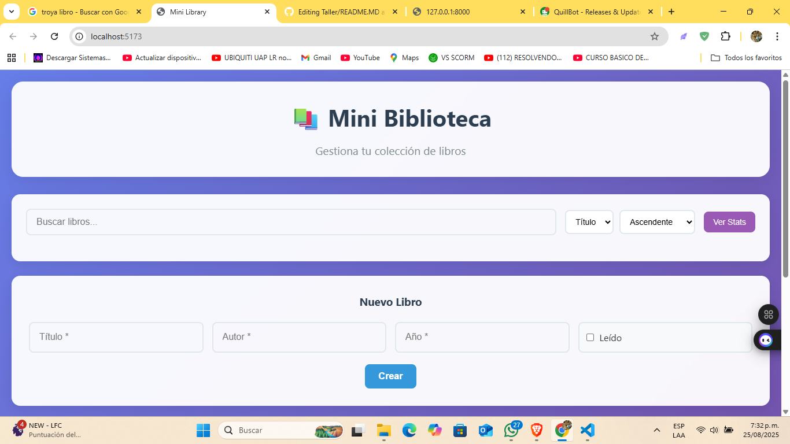

Una aplicación de gestión de biblioteca personal construida con React (frontend) y FastAPI (backend), que demuestra la arquitectura SPA + API REST con funcionalidades CRUD completas.

CARACTERISTICAS PRINCIPALES: 

- CRUD Completo: Crear, leer, actualizar y eliminar libros
- Búsqueda Inteligente: Búsqueda en tiempo real por título o autor
- Ordenamiento Flexible: Por título, autor o año  (ascendente/descendente)
- Paginación: Navegación eficiente con contador de páginas
- Validación: Validación robusta con Pydantic (backend) y HTML5 (frontend)
- Estados de UI: Loading, errores y confirmaciones
- Regla de Duplicados: No permite libros con el mismo título y autor
- Responsive Design: Interfaz adaptable a diferentes dispositivos

Tecnologías Utilizadas: 

Backend

FastAPI 0.104.1 
Pydantic 2.5.0 
Uvicorn 0.24.0 
Python 3.10+

Frontend

React 18+ - Biblioteca para interfaces de usuario
Vite 5+ - Herramienta de construcción rápida
JavaScript ES6+ - Lenguaje de programación
CSS3 - Estilos y diseño responsive

Prerrequisitos:

Python 3.10+
Node.js 18+ (LTS recomendado)
uv - Gestor de paquetes Python
npm - Gestor de paquetes Node.js

Instalación de uv:

Windows (PowerShell):
powershellpowershell -ExecutionPolicy Bypass -c "irm https://astral.sh/uv/install.p

1. Configurar el Backend

bash
# Navegar al directorio backend
cd backend

# Crear entorno virtual
uv venv .venv

# Activar entorno virtual

# Windows:
.venv\Scripts\Activate.ps1

# Instalar dependencias
uv pip install -r requirements.txt

2. Configurar el Frontend
bash
# Navegar al directorio frontend (nueva terminal)
cd frontend

# Instalar dependencias
npm install

# Configurar variables de entorno (opcional)
cp .env.development.example .env.development

3. Ejecución

Backend (Terminal 1)

cd backend
source .venv/bin/activate  
# Windows: .venv\Scripts\Activate.ps1
uv run uvicorn app.main:app --reload --port 8000

Frontend (Terminal 2)

cd frontend
npm run dev

Acceso a la aplicación

Frontend: http://localhost:5173
API Docs: http://127.0.0.1:8000/docs
API Redoc: http://127.0.0.1:8000/redoc

| Metodo    | Enpoint     | Descripción                                                  |
|-----------|---------    |--------------------------------------------------------------|
| GET       |/books       |Lista libros con filtros, ordenamiento y paginación           |
| POST      |/books       |Crea un nuevo libro                                           |
| GET       |/books/{id}  |Obtiene un libro por ID                                       |
|PUT        |/books/{id}  |Actualiza un libro                                            |
|DELETE     |/books/{id}  |Elimina un libro                                              |
GET         |//books/stats|Estadísticas de la biblioteca                                 |

Parámetros de consulta para GET /books

q: Búsqueda en título/autor (case-insensitive)
sort: title | author | year (default: title)
order: asc | desc (default: asc)
offset: Número de elementos a omitir (default: 0)
limit: Máximo elementos por página 1-100 (default: 10)

Ejemplo de uso
# Buscar libros que contengan "code" ordenados por año descendente
curl "http://127.0.0.1:8000/books?q=code&sort=year&order=desc&limit=5"

🎨 Funcionalidades de la UI

Gestión de Libros

 Agregar Libro: Formulario con validación en tiempo real
 Toggle Lectura: Marcar/desmarcar como leído con un clic
 Eliminar: Confirmación antes de eliminar permanentemente
 Visualización: Cards con información completa del libro

Búsqueda y Filtrado

 Búsqueda en Tiempo Real: Debounce de 300ms para eficiencia
 Búsqueda en Título/Autor: Case-insensitive
 Ordenamiento Dinámico: Por cualquier campo en ambas direcciones
 Paginación: Navegación suave con contadores

Estados de la Aplicación

 Loading: Indicadores durante peticiones HTTP
 Manejo de Errores: Mensajes claros y específicos
 Confirmaciones: Diálogos para acciones destructivas
 Feedback Visual: Estados diferenciados para libros leídos

Validaciones
 Backend (Pydantic)

  Título y Autor: Obligatorios, no vacíos (1-200 y 1-100 caracteres)
  Año: Entre 1500 y 2100
  Duplicados: Combinación única de título+autor (ignora mayúsculas/espacios)

 Frontend (HTML5 + JavaScript)

  Campos obligatorios con validación nativa del navegador
  Rango de años con input type="number"
  Feedback inmediato en caso de errores del servidor

 Códigos de Estado HTTP
|Código     | Descripción        |  Uso                         |
|-----------|--------------------|------------------------------|
|200        |OK                  |Operaciones exitosas          |
|201        |Created             |Libro creado exitosamente     |
|204        |No Content          |Libro eliminado exitosamente  |
|404        |Not Found           |Libro no encontrado           |
|409        |Conflict            |Libro duplicado (título+autor)|
|422        |Unprocessable Entity|Error de validación           |

Testing
 Pruebas Manuales con cURL
 Crear un libro:
  curl -X POST "http://127.0.0.1:8000/books" \
   -H "Content-Type: application/json" \
   -d '{"title":"Clean Code","author":"Robert C. Martin","year":2008,"read":false}'
 Buscar libros:
  curl "http://127.0.0.1:8000/books?q=code&sort=year&order=desc"
 Intentar duplicado (debería devolver 409):
  curl -i -X POST "http://127.0.0.1:8000/books" \
   -H "Content-Type: application/json" \
   -d '{"title":"Clean Code","author":"Robert C. Martin","year":2008}
Testing desde Swagger UI

 Visita http://127.0.0.1:8000/docs
 1.  Expande cualquier endpoint
 2. Haz clic en "Try it out"
 3. Ingresa parámetros y ejecuta
 
📁 Estructura del Proyecto:
PROYECYO/
    ├── README.md                 
    ├── backend/
    │   ├── app/
    │   │   ├── main.py          # Aplicación FastAPI principal
    │   │   ├── api/
    │   │   │   └── routes/
    │   │   │       └── books.py  # Endpoints de libros
    │   │   ├── core/
    │   │   │   └── config.py    # Configuración CORS
    │   │   └── models/
    │   │       └── schemas.py   # Modelos Pydantic
    │   └── requirements.txt     # Dependencias Python
    └── frontend/
        ├── src/
        │   ├── components/
        │   │   ├── BookForm.jsx   # Formulario de creación
        │   │   └── BookList.jsx   # Lista principal
        │   ├── api.js            # Cliente API
        │   ├── App.jsx           # Componente raíz
        │   ├── App.css           # Estilos principales
        │   ├── main.jsx          # Punto de entrada
        |   └── index.css         #estilos
        ├── .env.development      # Variables de entorno
        ├── index.html           # Plantilla HTML
        ├── package.json         # Dependencias Node.js
        └── vite.config.js       # Configuración Vite

DESARROLLADO POR: 
Juan Jose Baloco Sanchez, Codigo:2230722
David Astudillo Palmira, Codigo: 2231650
santiago vivas amaya, Codigo: 2230109